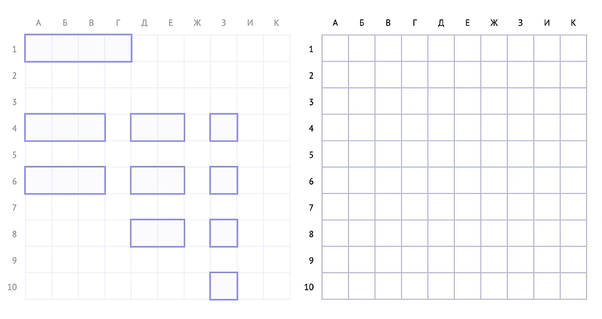

# Правила игры в *Морской бой*
## Об этой игре
*Морской бой* — это стратегическая игра для двух игроков, цель которой — уничтожить весь флот противника. Игроки по очереди называют координаты выстрелов, стараясь вычислить местоположение кораблей друг друга. Если выстрел не нанес урон, ход переходит к другому игроку.  Побеждает тот, кто первый уничтожил весь флот противника.
## Подготовка к игре
Каждому игроку для игры понадобится листок в клетку, ручка или карандаш. 

Перед началом игры каждый игрок должен на своем листе:
1. Начертить два поля размером 10х10 клеток. Слева — личное поле, справа — поле противника.
>Игроки не показывают друг другу свои записи.

2. Обозначить на каждом поле вертикали буквами от А до К.
>Буквы «ё» и «й» не используются.
3. Обозначить на каждом поле горизонтали цифрами от 1 до 10.
4. Разместить на своем поле 10 кораблей. При размещении **корабли не могут касаться друг друга сторонами и углами**.

    |Тип корабля|Длина|Количество кораблей на поле|
    |--|--|--|
    |Однопалубный|1 клетка| 4|
    |Двухпалубный|2 клетки| 3|
    |Трехпалубный|3 клетки| 2|
    |Четырехпалубный|4 клетки| 1|

>Корабли могут располагаться вертикально или горизонтально.

Пример подготовки к игре:

Правое поле перед началом игры остается пустым.
Игроки договариваются о том, кто будет делать первый ход.
## Ход игры

В свой ход игрок называет координату выстрела — комбинацию буквы и цифры. Например, *Б4*.

В ответ противник говорит:
- *Мимо* — если в названной клетке у него нет корабля.
- *Ранен* — если в названной клетке есть корабль, но выстрел его полностью не уничтожил.
- *Убит* — если в названной клетке есть корабль и выстрел его полностью уничтожил.

Игрок, который совершил выстрел, отмечает на своем листе в поле противника названную клетку знаком:
- &#9746; — если в клетке есть корабль. Игрок делает еще один ход.
- &sdotb; — если в клетке нет корабля. Ход переходит к противнику.

>Если корабль убит, для удобства можно обвести его по периметру и расставить вокруг него &sdotb;, чтобы обозначить клетки, в которых у противника точно не может быть кораблей, потому что корабли не могут касаться друг друга сторонами и углами.

Игра продолжается до тех пор, пока один из игроков не уничтожит все корабли противника.

